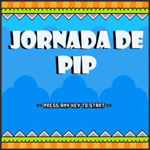
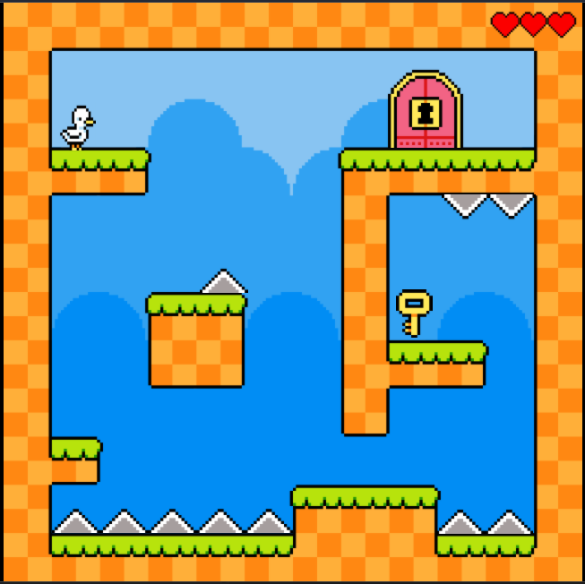

# Game-Duck

# Pip e Lia: A Jornada de Volta para Casa

---

## Descrição Geral

> **Pip e Lia** A Jornada de Volta para Casa é um jogo de aventura e plataforma 2D que conta a história de Pip, um pato que foi separado de sua família após uma forte ventania.
> O jogador deve guiá-lo por diversos níveis cheios de desafios até que ele consiga voltar para sua companheira Lia e o ovo prestes a nascer. 💖

## Enredo

Durante um dia tranquilo no lago, Pip brincava ao lado de sua amada Lia.
Mas uma forte rajada de vento o arrastou para longe, deixando-o perdido.

Agora, Pip precisa enfrentar terrenos perigosos, obstáculos e inimigos naturais para retornar para casa e reencontrar sua família.

A missão do jogador é levar Pip de volta até Lia ❤️.

## Objetivo do Jogo

- Completar todos os níveis
- Desviar de obstáculos
- Superar desafios de plataforma
- Guiar Pip com segurança até sua família

## Visual do Jogo

---

## Como Jogar

O jogo é um **plataforma 2D** focado em movimento e _timing_.

| Ação          | Comando |
| :------------ | :------ |
| **Mover**     | ➡️⬅️    |
| **Pular**     | ⬆️      |
| **Interagir** | ⬇️      |

---

## Detalhes Técnicos e Acesso

### Ferramentas Utilizadas

- **Engine:** **Construct 3** (O desenvolvimento completo do jogo foi feito nesta engine.)
- **Arquivo do Projeto:** `Duck Game.c3p`

### ▶️ Instruções de Execução

#### Abrir o Projeto no Construct 3

1.  Acesse o Construct 3 (web ou versão offline).
2.  Clique em **Open** → **Open .c3p** e selecione o arquivo `Duck Game.c3p`.
3.  Pressione **F5** para rodar o jogo no Preview.

## Equipe

- Igor Gabriel Rodrigues
-
-
